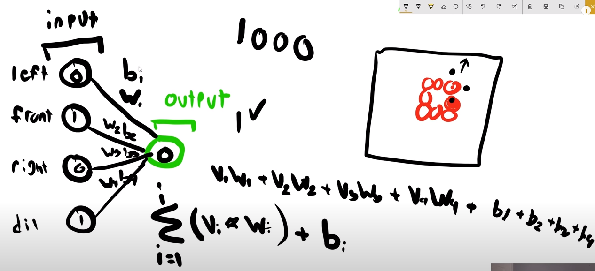
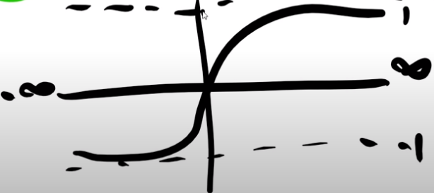
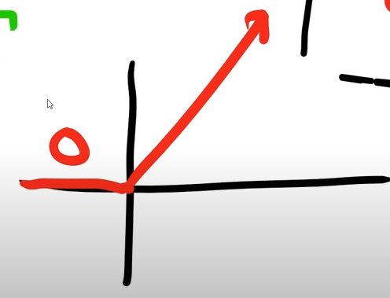

# Tensorflow 2.0 Tutorial

[Text-based tutorial in Tim's website][9]

[9]: https://www.techwithtim.net/tutorials/python-neural-networks/

[Youtube list of videos][10]

[10]: https://youtube.com/playlist?list=PLzMcBGfZo4-lak7tiFDec5_ZMItiIIfmj

## 1. What is a Neural Network?

### What it is

It's only the visual representation of a function, or concatenation of functions,
although there is some high level 'chamuyo' going around regarding that it is
inspired in how neurons work.

### How it looks

The representation is as follows: there are *input neurons*
and one or more *output neurons*.
Let's imagine only one.
Then we can perform a *linear combination* of the inputs to calculate the output.

We can see in the image that instead of a single bias, we have one bias per
input neuron ($b_i$).
That is a practical feature that comes in handy when not all the inputs are
connected to the output, or we can even think in more complex structures with
middle hidden layers and different types of connections.

### Activation function

The output, as explained so far, isn't bound to any domain but it can take any
value, because it is calculated as a linear function.
This sometimes isn't practical because we want the result to be bounded, like in
the example of the snake game: we want a very finite answer: yes or no.

In that case we can apply an *activation function*, which takes the output from
the linear combination as an input and returns a different value.
So we could think that as an extra layer of 1 to 1 neurons, but I don't know if
the community thinks of it that way.

A very known function is the sigmoid function:

This function is very useful because it returns a value bounded in (-1,1).
Maybe that is why its named *activation* function, because it can take the
actual output and transform it into a value that is easier to interpret as
yes or no.

Another possible activation function is to get rid of negative values by
making them 0, and keep only positive values (possibly also changed).

This helps because it makes easier later to calculate the error or loss.

### Loss function

This is a function that calculates the error between the actual output and the
expected output.

Is there always an expected output? That is a good question.

## 2. Loading & Looking at Data

[Second video from Tim in this Tutorial](https://youtu.be/wu9IH1Xvdd4).

This example uses a [dataset that is included in *Keras*][1], which is some
wrapper of TensorFlow, or framework that uses TensorFlor, or something like that.
The video also follows the [TensorFlow tutorial][2] but adding some more stuff
(or so says Tim).

[1]:(https://keras.io/api/datasets/)
[2]:(https://www.tensorflow.org/tutorials/keras/classification)

I follow this tutorial in the file `./code/02.py`.
I decided to stop using notebooks because it doesn't run as smoothly,
although I'll try to convert the python code to a notebook at the end to print
a nice html of the tutorial.

This example loads the dataset, takes an already done split in train and test
data, and visualizes the data (images).
Take a look by running the script.