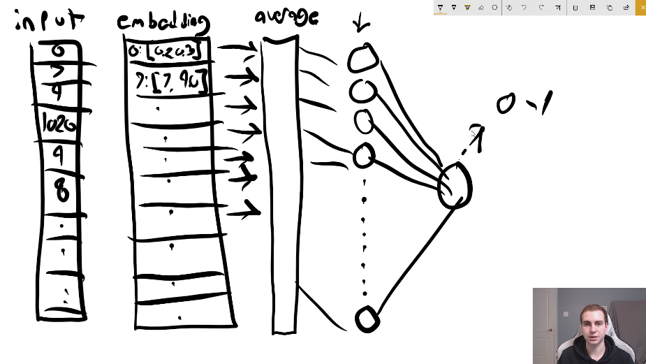

# Tensorflow 2.0 Tutorial

[Text-based tutorial in Tim's website][9]

[9]: https://www.techwithtim.net/tutorials/python-neural-networks/

[Youtube list of videos][10]

[10]: https://youtube.com/playlist?list=PLzMcBGfZo4-lak7tiFDec5_ZMItiIIfmj

## 1. What is a Neural Network?

### What it is

It's only the visual representation of a function, or concatenation of functions,
although there is some high level 'chamuyo' going around regarding that it is
inspired in how neurons work.

### How it looks

The representation is as follows: there are *input neurons*
and one or more *output neurons*.
Let's imagine only one.
Then we can perform a *linear combination* of the inputs to calculate the output.


We can see in the image that instead of a single bias, we have one bias per
input neuron ($b_i$).
That is a practical feature that comes in handy when not all the inputs are
connected to the output, or we can even think in more complex structures with
middle hidden layers and different types of connections.

### Activation function

The output, as explained so far, isn't bound to any domain but it can take any
value, because it is calculated as a linear function.
This sometimes isn't practical because we want the result to be bounded, like in
the example of the snake game: we want a very finite answer: yes or no.

In that case we can apply an *activation function*, which takes the output from
the linear combination as an input and returns a different value.
So we could think that as an extra layer of 1 to 1 neurons, but I don't know if
the community thinks of it that way.

A very known function is the sigmoid function:


This function is very useful because it returns a value bounded in (-1,1).
Maybe that is why its named *activation* function, because it can take the
actual output and transform it into a value that is easier to interpret as
yes or no.

Another possible activation function is to get rid of negative values by
making them 0, and keep only positive values (possibly also changed).


This helps because it makes easier later to calculate the error or loss.

### Loss function

This is a function that calculates the error between the actual output and the
expected output.

Is there always an expected output? That is a good question.

## First Steps

### Video 2. Loading & Looking at Data

[Second video from Tim in this Tutorial](https://youtu.be/wu9IH1Xvdd4).

This example uses a [dataset that is included in *Keras*][1], which is some
wrapper of TensorFlow, or framework that uses TensorFlor, or something like that.
The video also follows the [TensorFlow tutorial][2] but adding some more stuff
(or so says Tim).

[1]:(https://keras.io/api/datasets/)
[2]:(https://www.tensorflow.org/tutorials/keras/classification)

I follow this tutorial in the file `./code/02.py`.
I decided to stop using notebooks because it doesn't run as smoothly,
although I'll try to convert the python code to a notebook at the end to print
a nice html of the tutorial.

This example loads the dataset, takes an already done split in train and test
data, and visualizes the data (images).
Take a look by running the script.

### Video 3. Creating a Model

[Link to the YouTube Video](https://youtu.be/cvNtZqphr6A)

We continue with the image selection model.
See file `code/03.py`

Our **input** data is an image (well a bunch of images).
Each image comes as a 28x28 matrix (our input data).
This doesn't work yet for a neural network, we need to *flatten* the data,
so we can pass each value to a neuron.
Then we get an array of 28*28=784, and that is our input to our NN: so we have
784 neurons.

Our **output** layer won't be a single neuron, but 10 neurons, each one
representing one of the 10 classes.
Each one of these neurons is going to have a value, which is going to represent
how much the NN believes that the image belongs to that class.

Although we could do with just two layers, that wouldn't be of much use.
We need to add **hidden layers**.
We can choose how many neurons will have our hidden layer: we can work with
percentages from our input layer, but in this case we're just going to do with
128 neurons.
And we will do a *full connection*: every input neuron with every middle neuron,
and again between middle and output neurons.

### Video 4. Using the Model to Make Predictions

[Link to the YouTube Video](https://youtu.be/RqLD1INA_cQ)

Code in `code/04.py`

For the moment we're retraining the model each time that we are using it, but
it could be better to save it. So what I did was to look up in Keras docs how to
save the model and did that in `03.py`, then in `04.py` I just load the saved
model and that saves a bunch of time when testing.

Then in `04.py` we use the model to make predictions and it is beautiful!

## Text Classification

### Get the data

File: `05.py`

[Link to the YouTube Video](https://youtu.be/k-_pWoy2fb4)

Tim follows [TensorFlow 2.0 tutorial on text classification][3] for this,
at least at first, and then continues in a different direction.

[3]:https://www.tensorflow.org/tutorials/keras/text_classification

We'll still keep using Keras data, which is easier and nicer. But it is relevant
to know that in real life data is difficult at first, it needs cleaning, a lot!

At the end of the video Tim set's the model but I leave that to the next section
and file.

### Arquitecture of the model

File: `05.py`

[Link to the YouTube Video](https://youtu.be/qpb_39IjZA0)

Let's talk a bit about the arquitecture of the network, because it has some new
stuff.

Let's see two strings and their integer mappings:

```
s1 = have a great day -> [0, 1, 2, 3]
s2 = have a good day -> [0, 1, 4, 3]
```

Although we know these strings are very similar, the computer only sees
different numbers in the position 3. And that could mean anything at first.

Something that is done is to create ***word vectors***, with each word being
represented by a vector of dimension 16 (I think).
So instead of having a string being a list of integers, it will actually be a
list of vectors, and then we can compute the distances,o rientations, etc,
of the vectors.
Also, the *context* matters, because the words that are close can affect the
vector of a word, making it change its meaning: `'very good' ~ 'great' > 'good'`

So that is ***embedding*** (first layer of the NN): taking the list ofintegers and parsing that to a
list of vectors, to represent the list of words that is the original text.
Then we take the average in our next layer: shrink the vectors down by
averaging their data.
Then we use a dense layer of 16 neurons (that is what the tutorial uses but it
is possible to play around with that value).
And finally that is connected to one output to get a value and pass it to a
sigmoid function to get a value between 0 and 1 to decide if it is a good or bad
review.

So:
0. Input
1. Embedding
2. Average
3. Dense
4. Output


