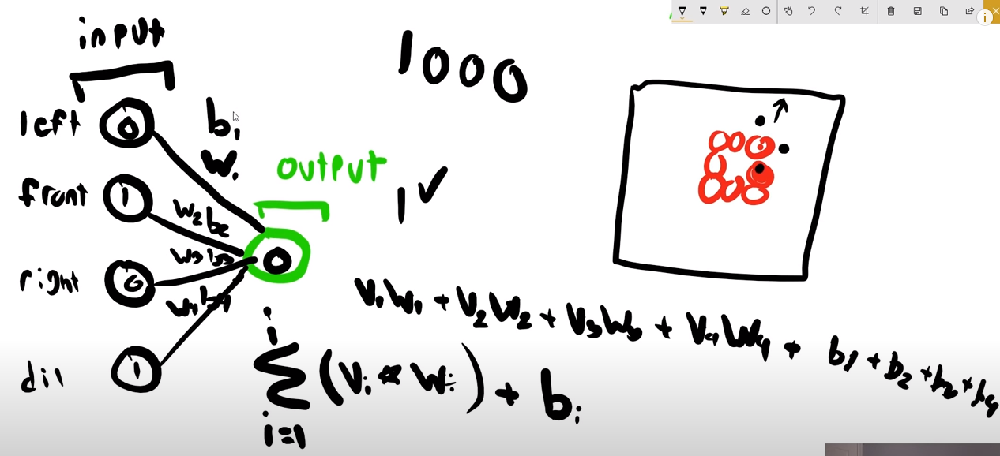
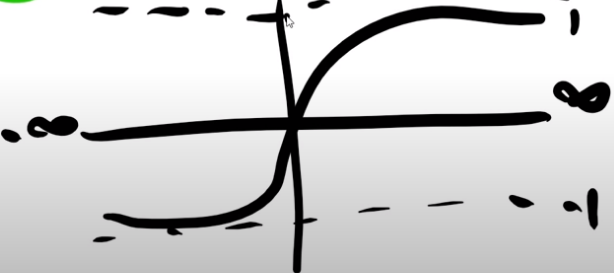
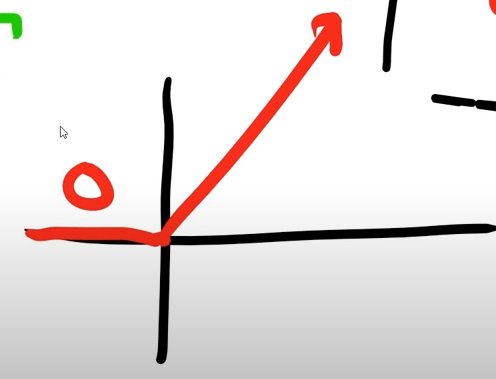

# Tec With Tim - Machine Learning - Tutorial

I'll follow [Tec With Tim's tutorial on Machine Learning][1].

It is an introductory tutorial on Machine Learning, previous to Deep Learning
and Neural Networks.

The tutorial also has a [text version][2] in Tim's website.

The data used is from the popular [UCI Machine Learning Repository][3].

[1]: https://youtube.com/playlist?list=PLzMcBGfZo4-mP7qA9cagf68V06sko5otr
[2]: https://www.techwithtim.net/tutorials/machine-learning-python/linear-regression/
[3]: https://archive.ics.uci.edu/ml/index.php
## 1. Introduction

1. Set up virtual environment.
2. Installation of tensorflow and keras.
3. Import.

## 2. Linear Regression

See file: `code/01.ipynb`

## 3. Saving Models and Plotting Data

See file: `code/01.ipynb` (search for the title)

## 4. KNN: K-nearest Neighbor

See file: `code/02.ipynb` (search for the title)

In this case we work with ***irregular data***, meaning that the dataset was
not previously prepared for as in a nice csv file with no missing values and no
wrong values.

KNN searches for the <k> nearest neighbors.
To do that it needs to compute the distance for **all** points, and then it
only keeps the k nearest.
As a result it is very slow when calculating predictions and it doesn't quite
make sanse to save the model, as it was the case of Linear Regression.

Nice explanation and pictures at [Tim's Website][4]

[4]: https://www.techwithtim.net/tutorials/machine-learning-python/k-nearest-neighbors-3/

## 5. SVM: Support Vector Machines

For this case the data is imported from sklearn datasets.
It is easier to use so it is good to test the models directly.
However since it is so easy to use and it is already prepared, it is unreal for
a real case where data comes in irregular shape and with missing or wrong values.

SVM creates a hyperplane to divide the data.
(It can also be used for regression but we won't do that here).

To check out the math see [Tim's video on SVM][5], specially to understand
about kernels to increase the number of features when the data isn't capable
to be separated by a hyperplane.
This [video][6] is another nice resource to visualize the application of
kernels to increase the number of dimensions to make it possible to separate
the data with a hyper-plane.
I guess it's equivalent to increasing the complexity of the separation geometry
from a hyper-plane to something else, like a hyper-circle (if that is a thing).

From a [quora question][7]:
**What are kernels?**
A kernel is a similarity function.
It is a function that you, as the domain expert,
provide to a machine learning algorithm.
It takes two inputs and spits out how similar they are.

**But**: I think that what it actually does is to make some calculation with
the values and then that is added as a new dimension.  
*What for?* It's because since we want to split the data with a hyper-plane, 
then if the data is actually separated by a hyper-curve (or whatever), then 
this is a workaround.  
*For example:* To split the data with a circle (inside vs outside) we can use
as a kernel a function (x^2 + y^2), then add that as a third dimension (z) and 
split the data with a plane parallel to the xy plane in z=z0.  
Think about that, it is exactly as splitting the data with a circle.

[5]: https://youtu.be/JHxyrMgOUWI
[6]: https://youtu.be/3liCbRZPrZA
[7]: https://www.quora.com/What-are-kernels-in-machine-learning-and-SVM-and-why-do-we-need-them

## 6. K-means Clustering

This is our first unsupervised learning algorithm:
we don't have to feed the labels for the data (train or test).

Previously we gave the features and the output, the models just had to find
the correct function to predict a new output given its features.

Now we only have outputs, the features have to be determined by the model too.

<K> is the number of clusters.

The math is explained in [Tim's video][8] and maybe in other places as well.

It is a quite heavy algorithm regarding the computational cost,
because it needs to compute the distance between the cluster centroids and
the data points for every cluster, and every point, and every iteration, and
every feature.
Still it's not as much costly as other clustering alogirthms.

[8]: https://youtu.be/g1Zbuk1gAfk

# Tensorflow 2.0 Tutorial

[Text-based tutorial in Tim's website][9]

[9]: https://www.techwithtim.net/tutorials/python-neural-networks/

[Youtube list of videos][10]

[10]: https://youtube.com/playlist?list=PLzMcBGfZo4-lak7tiFDec5_ZMItiIIfmj

## 1. What is a Neural Network?

### What it is

It's only the visual representation of a function, or concatenation of functions,
although there is some high level 'chamuyo' going around regarding that it is
inspired in how neurons work.

### How it looks

The representation is as follows: there are *input neurons* 
and one or more *output neurons*. 
Let's imagine only one. 
Then we can perform a *linear combination* of the inputs to calculate the output.

We can see in the image that instead of a single bias, we have one bias per
input neuron ($b_i$).
That is a practical feature that comes in handy when not all the inputs are
connected to the output, or we can even think in more complex structures with
middle hidden layers and different types of connections.

### Activation function

The output, as explained so far, isn't bound to any domain but it can take any
value, because it is calculated as a linear function.  
This sometimes isn't practical because we want the result to be bounded, like in
the example of the snake game: we want a very finite answer: yes or no.  

In that case we can apply an *activation function*, which takes the output from
the linear combination as an input and returns a different value. 
So we could think that as an extra layer of 1 to 1 neurons, but I don't know if
the community thinks of it that way.

A very known function is the sigmoid function:

This function is very useful because it returns a value bounded in (-1,1).  
Maybe that is why its named *activation* function, because it can take the
actual output and transform it into a value that is easier to interpret as
yes or no.

Another possible activation function is to get rid of negative values by
making them 0, and keep only positive values (possibly also changed).  

This helps because it makes easier later to calculate the error or loss.

### Loss function

This is a function that calculates the error between the actual output and the
expected output.

Is there always an expected output? That is a good question.